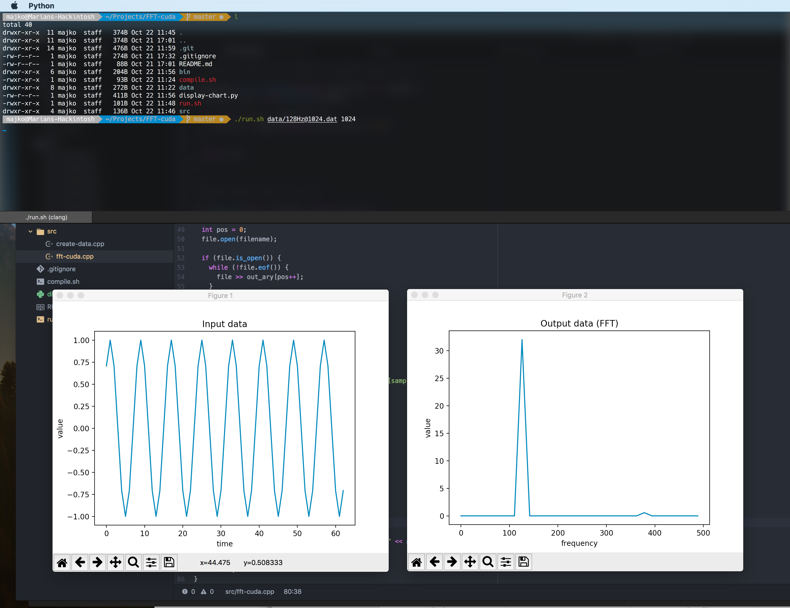

# FFT-cuda
Fast Fourier Transform implementation, computable on CUDA computing platform

## How to run

Compile with `compile.sh`.

Example run:

```
$ ./bin/fft-cuda data/test 44100
```

## Screenshot


